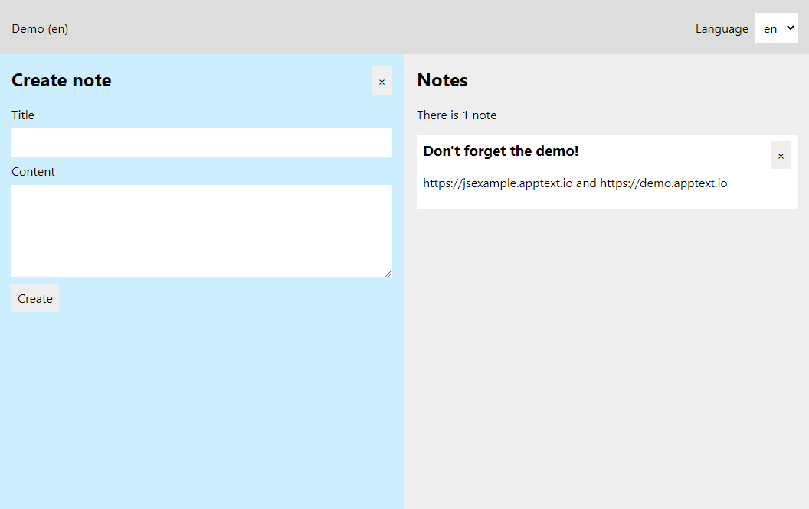

# AppText JavaScript/React example

This is an example React Single Page Application that uses [i18next](https://www.i18next.com/) and [AppText](https://apptext.io) for localization.



## Getting started
The example is configured to use the [apptext-demo docker image](https://hub.docker.com/r/apptextio/apptext-demo) as AppText backend.

Make sure to have [docker](https://docs.docker.com/get-docker/) installed and then start the AppText backend with

```
docker run --name apptext-demo -p 8000:80 -e CorsOrigins=http://localhost:3000 apptextio/apptext-demo
```

Check if AppText is running by navigating to http://localhost:8000. You'll be asked to create an admin account and after that, you can log in with the newly created account.

When the backend is running, you can try the example application with:

```
npm install
```

followed by:

```
npm start
```

Check out the example in the browser by navigating to http://localhost:3000.