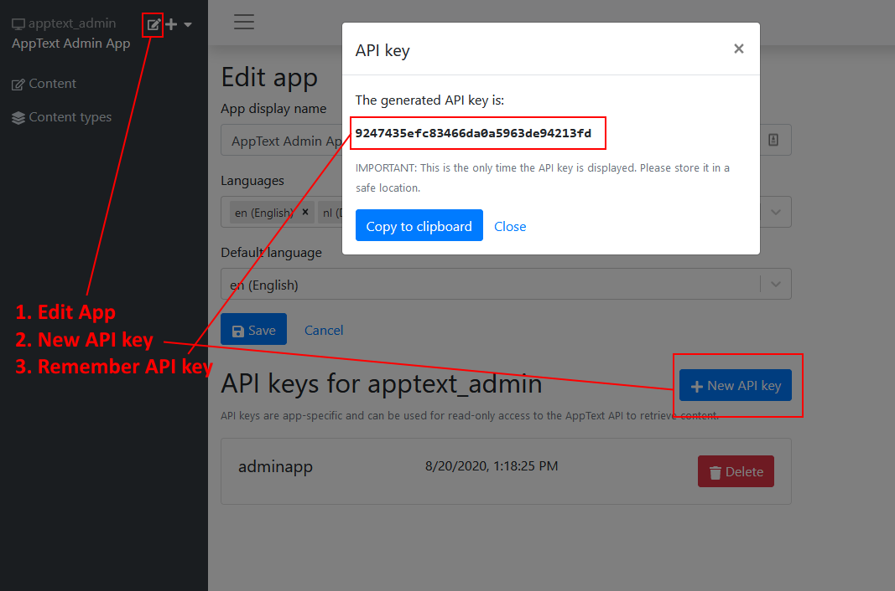

The public API endpoints (REST and GraphQL) are protected with an API key. Consumers of those endpoints need to add an HTTP header `X-API-KEY` with a valid Api Key.

You can create API keys via the Admin interface:

For security reasons, API keys are hashed, so you cannot retrieve those later. However, you can always generate new API keys later on.