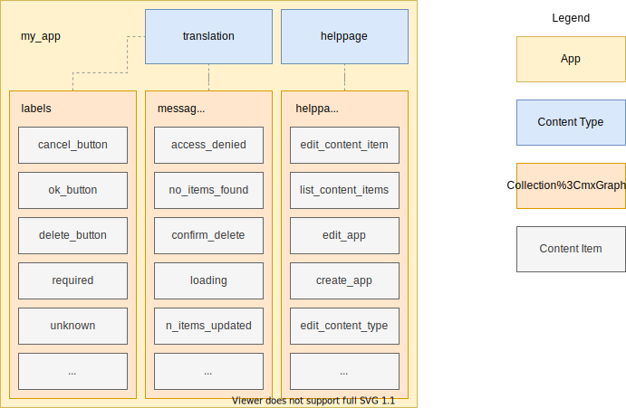

## App

The App is the top level container for content. It contains Collections and Content Types. It also contains the available languages and the default language.

A single AppText installation can contain multiple Apps.

## Collection

A Collection is a container for `Content Items` and is linked to a single `Content Type` that defines the structure of the Content Items. 

Example Collections could be 'Labels' or 'Help Pages'. 

## Content Type

The Content Type defines the fields of the Content Items. The available field types are ShortText (max 500 characters), LongText (unlimited), Number and DateTime.

Example Content Types are 'Translation' or 'Help Page'.

*Note: for convenience, there is a single built-in Content Type 'Translation' that contains only a single ShortText field and is always available for all Apps.*

## Content Item

The Content Item contains the actual content in the fields that are defined by the Content Type. All Content Items require a unique content key (within an App) that is used to lookup items. 

When a field has a localizable field type, it contains the content for all languages.

A simplified example a of Content Item:
```json
{
  "contentKey" : "cancel_button",
  "content": {
    "text": {
      "en": "Cancel",
      "nl": "Afbreken"
    }
  }
}
```

